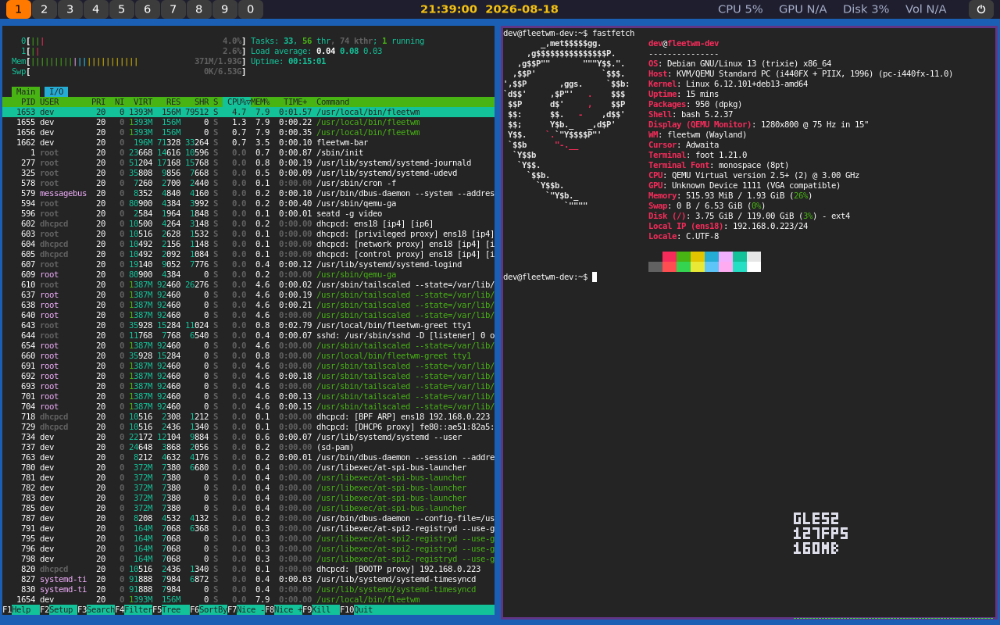

# Fleetwm

A minimal, fast Wayland window manager and desktop shell for Debian and
Ubuntu/Kubuntu. Built on [wlroots](https://gitlab.freedesktop.org/wlroots/wlroots)
in C++, with a thin GTK4 top bar, settings app, app launcher, and power
menu/lock screen. No file manager, no bundled productivity apps -- just
tiling window management, a bar, and the handful of desktop-shell pieces
every session actually needs, aimed squarely at low idle resource usage
and uncompromised gaming performance.

## Status

Early development. See [docs/adr](docs/adr) for the design decisions
behind the architecture, and the project plan for the phased roadmap this
is being built against.

## Features (target v1 scope)

- Tiling window manager (master-stack layout + floating toggle), per-output
  workspaces 1-9/0 with persistent per-workspace layout state
- Top bar: workspace switcher, live clock (`yyyy-mm-dd hh:mm:ss`), volume,
  CPU/GPU/disk usage
- Settings app: rounded/sharp corner toggle, 5 themes (Dark, Catppuccin,
  Dracula, OLED Black, Light), custom or wallpaper-auto-extracted accent
  color
- Settings app -- Bar tab: workspace-button corner shape, per-workspace
  colors; Wallpaper tab: image or solid-color background
  (`fleetwm-wallpaper`), applied live
- Battery indicator and power-profile switching (Normal/Performance/
  Battery Saver) in the bar and Settings, shown only on machines with a
  battery
- Settings app -- Default Apps: per-category default application picker
  (browser, terminal, file manager, image viewer, etc.), backed by
  standard `xdg-mime`/`mimeapps.list` associations so OS-level and other
  XDG-aware apps see the same defaults fleetwm sets
- Settings app -- About: hardware summary (CPU, GPU, RAM, disk, kernel)
  and project info (fleetwm version, license, links), in the spirit of
  KDE's/XFCE's/Windows' "About This System" pages
- Power menu (`fleetwm-powermenu`, click the power icon at the right
  edge of the bar): Lock, Log out, Sleep, Reboot, Shut down, as a
  centered card over a full-screen overlay
- Lock screen (`fleetwm-locker`, `Alt+Shift+L` or the power menu's
  Lock): PAM-verified password prompt reusing the greeter's visual
  language; gates every global keybind while locked
- Systray (StatusNotifierItem/`org.kde.StatusNotifierWatcher`) in the
  bar, for apps like Steam/Discord that dock a tray icon
- Themed pinned-window borders (accent-colored, configurable
  thickness) for always-on-top windows, set in Settings' Theme tab
- Audio mixer (`fleetwm-audiomixer`, click the volume stat in the bar):
  master volume slider plus a live per-application slider for every
  currently-playing app (PipeWire's stream graph, same data
  `pavucontrol`/`wpctl` show), as a compact popup near the bar. The same
  controls are also available as Settings' Audio tab.
- App launcher (`fleetwm-launcher`, `Alt+D`): minimal Albert/dmenu-style
  popup, fuzzy search over installed applications (via `GDesktopAppInfo`)
  with a category hint per result, plus a "Run Command" fallback for
  typed shell commands
- XWayland support for legacy X11 apps
- Debug overlay (`Alt+Shift+I`): a per-output frame-time bar graph plus
  live renderer backend/FPS/RAM/CPU-MHz text, for actually seeing render
  performance (and whether it's GPU-accelerated or software) rather than
  guessing at it -- drawn with a hand-coded bitmap font (no font
  library) and reads no storage at all (RSS via a pure `getrusage()`
  syscall; CPU MHz via sysfs, which is generated in-kernel and never
  touches a disk either)
- `fleetwm-update`: pulls and rebuilds the latest version in place



## Requirements

- Debian 13.6 (Trixie) or Ubuntu/Kubuntu 26.04 LTS
- A display manager that lists Wayland sessions (GDM, SDDM, LightDM all
  work) -- or the bundled graphical `fleetwm-greet` login screen, see
  [Greeter](#greeter) below

## Supported hardware

Architecture support is meant to be general -- nothing in fleetwm is
written against a specific CPU or GPU vendor -- but the table below is
what has actually been run and verified, not just assumed to work.

All single-board-computer testing is done and provided by this repo's
owner, using [eqvaldi/releases V4-LTS-3](https://github.com/eqvaldi/releases/releases/tag/V4-LTS-3)
as the SBC OS base.

| Platform | Arch | GPU rendering | Status |
| --- | --- | --- | --- |
| Generic x86_64 (QEMU/KVM VM, `fleetwm-dev`) | x86\_64 | llvmpipe (software, no virtio-GPU 3D) | Primary development target; verified continuously |
| Exynos5422 (Mali-T628 MP6) | armhf | pixman (software) -- kernel has no Panfrost driver built in ([`CONFIG_DRM_PANFROST`](https://docs.mesa3d.org/drivers/panfrost.html) unset), so GLES2/EGL init fails and the compositor falls back automatically | Verified end-to-end on real hardware (2026-08-18): greeter, login, bar, wallpaper all confirmed working over the software renderer |
| Asus Tinker Board (Rockchip RK3288) | armv7l | untested -- build never completed | **Blocked, hardware issue, not a fleetwm bug** (2026-08-19): a full-parallelism `ninja` build (4 jobs) on this board's 2GB RAM caused it to drop off the network entirely mid-compile -- reproduced, not a one-off. This board's Micro-USB power input is a [documented Armbian undervoltage/brownout issue](https://www.hometutoring.co.nz/electronics/rpi_alt.php#:~:text=Armbian%20notes%3A%20%22Severe%20powering%20troubles%20due%20to%20Micro%20USB%20power%20connector.%20It%27s%20recommended%20to%20power%20through%20GPIO%20pins%20to%20prevent%20under%2Dvoltage%20issues%20(instabilities%2C%20boot/crash%20cycles).%20Powering%20situation%20is%20a%20little%20improved/masked%20on%20model%20S.%22), not something the compositor code can fix. If retrying: power via the GPIO pins instead of Micro-USB, and cap build parallelism (`ninja -j1`/`-j2`) to reduce peak draw. |

Any GPU whose driver fails hardware EGL initialization (not just one
missing an extension) gets the same automatic pixman software-rendering
fallback the Exynos5422 board uses above -- see
`wlr_pixman_renderer_create()` in `src/compositor/server.cpp`. That
keeps the desktop usable, just without GPU acceleration, on hardware
like older/unsupported Mali Midgard GPUs.

## Install

```sh
git clone <this-repo-url> fleetwm
cd fleetwm
./install.sh
```

This installs build dependencies via `apt`, builds with Meson/Ninja, and
installs:

- `fleetwm`, `fleetwm-bar`, `fleetwm-settings`, `fleetwm-launcher`,
  `fleetwm-wallpaper`, `fleetwm-powermenu`, `fleetwm-audiomixer`,
  `fleetwm-greet`, `fleetwm-greeter-login`, `fleetwm-locker` to
  `/usr/local/bin`
- A `Fleetwm` session entry to `/usr/share/wayland-sessions/` (log out and
  pick it from your display manager's session list)
- Default theme files and `theme.toml` to `/etc/xdg/fleetwm/`
- `seatd` (installed and enabled as a system service) -- the greeter's
  own login-screen compositor needs it for DRM/seat access before
  anyone's logged in, see [Greeter](#greeter)
- The `fleetwm-greet` PAM config and systemd unit (not enabled by
  default -- see [Greeter](#greeter))

It also adds your user to the `input`, `video`, `render`, `audio`, and
`plugdev` groups (whichever exist on your system) -- the compositor needs
these for keyboard/mouse (`input`), GPU/DRM (`video`/`render`), and audio
device access. **Log out and back in (or reboot) after installing**, so
this group membership actually takes effect -- if you skip this, input or
rendering can fail silently with no error message, since a
permission-denied device node just looks like "no device" to
libinput/wlroots.

Log out and select **Fleetwm** as your session to start using it.

## Greeter

`fleetwm-greet` is a themed graphical login screen bundled with fleetwm,
for anyone who'd rather not run a full display manager. It's a real,
minimal wlroots compositor in its own right (see
[ADR 0006](docs/adr/0006-custom-pam-tty-greeter-vs-display-manager.md)
for why a custom greeter exists at all instead of depending on a display
manager): a Windows-7-style picker of every real local account, each shown
as a square avatar tile, plus an "Other User" tile for typing an
arbitrary name. Picking a tile locks the username and asks only for a
password; the background, accent color, and corner style all match
whatever's currently set in `fleetwm-settings`. **Root login is refused
outright** -- it never appears in the picker and is rejected server-side
even if typed under "Other User" -- root is meant to stay a deliberate
terminal/rescue-shell login, not a routine desktop session.

It's installed but not enabled by default; `install.sh` prints the exact
commands to opt in on your main console (tty1):

```sh
sudo systemctl disable --now getty@tty1.service
sudo systemctl enable --now fleetwm-greeter@tty1.service
```

Swap `tty1` for another VT (e.g. `tty2`) if you'd rather leave your normal
login console untouched and just try the greeter alongside it.

Switch to that VT (`Ctrl+Alt+F2`) to see the login screen. Requires
`seatd` running (`install.sh` installs and enables it automatically) --
the greeter's compositor needs a seat backend to get DRM access before
anyone's logged in, and `seatd` is what arbitrates that without opening a
login session of its own (which would collide with the one PAM opens for
whoever actually logs in). Build with `-Dgreeter=false` to skip the
greeter (and its `libpam` dependency) entirely.

## Updating

```sh
fleetwm-update
```

Pulls the latest source, rebuilds, and reinstalls in place. Requires
having installed via `install.sh` (it tracks the source checkout path in
`/etc/fleetwm-source-path`).

## Configuration

Edit `~/.config/fleetwm/theme.toml` directly, or use the settings app
(`fleetwm-settings`, launch it via the app launcher, `Alt+D`):

```toml
corner_style = "rounded"   # "rounded" | "sharp"
theme = "dark"             # "dark" | "catppuccin" | "dracula" | "oled_black" | "light"
accent = "auto"            # "auto" | "#RRGGBB"
```

Changes made via the settings app apply live, without restarting the bar
or compositor.

## Default keybinds

| Keybind             | Action                                    |
|---------------------|--------------------------------------------|
| `Alt+Return`        | Spawn a terminal (Settings' Default Apps tab; `foot` by default) |
| `Alt+Shift+Return`  | Promote the focused window to master      |
| `Alt+D`             | Open the app launcher                     |
| `Alt+Shift+Q`       | Close the focused window                  |
| `Alt+H`/`J`/`K`/`L` | Focus window left/down/up/right (spatial, vim-style) |
| `Alt+Shift+P`       | Toggle always-on-top pinning               |
| `Alt+Shift+F`       | Toggle floating (opt out of tiling)       |
| `Alt+Shift+L`       | Lock the session                          |
| `Alt+Shift+S`       | Region-select screenshot, copied to clipboard |
| `Alt+Escape`        | Quit the compositor                       |
| `Alt+Shift+I`       | Toggle the debug overlay (frame-time bar graph + FPS/RAM/CPU-MHz text, bottom-right of each output) |
| `Super+1`..`0`      | Switch to workspace 1-9, 0                |

More tiling/focus keybinds land in Phase 1. `Alt`, not `Super`, is used
for the terminal/quit binds in Phase 0 since `Super` is often already
claimed by the host compositor during nested development testing.

The *key* half of every Alt+`<key>`/Alt+Shift+`<key>` bind above is
remappable via `~/.config/fleetwm/keybinds.toml` (the modifier itself
stays fixed). Each field takes an xkb key name (e.g. `"Return"`, `"d"`,
uppercase like `"Q"` for a Shift-combined bind), picked up live with no
restart needed:

```toml
terminal = "Return"       # + Shift = promote focused window to master
launcher = "d"
close_window = "Q"
toggle_pin = "P"
toggle_float = "F"
lock = "L"
screenshot = "S"
focus_left = "h"
focus_down = "j"
focus_up = "k"
focus_right = "l"
quit = "Escape"
debug_overlay = "I"
```

## Building from source manually

```sh
meson setup build --prefix=/usr/local --buildtype=release
ninja -C build
sudo ninja -C build install
```

`install.sh` builds with a heavier set of flags than the plain command
above -- LTO, `-march=native`, dead-code stripping, and more (see its own
comments for what and why) -- **and now always builds with profile-guided
optimization (PGO) on top**, via `scripts/build-pgo-auto.sh`: an
instrumented build, a synthetic training pass
(`scripts/pgo-train-session.sh`, driving bar/wallpaper/settings/
launcher/powermenu/audiomixer against the compositor under wlroots'
headless backend, no live usage session required), then a final
profile-optimized rebuild. This is mandatory, not opt-in -- every
`install.sh` run pays the extra build time (roughly a minute or two more
than a plain build) for a profile-guided binary, not just installs where
someone happened to run PGO by hand. `scripts/build-pgo.sh` (which
`build-pgo-auto.sh` wraps) still works standalone too, for a real
live-usage training session instead of the synthetic one -- see that
script's header comment for the manual `generate`/`use` steps.

A `tests/` unit-test suite (GTest, fetched via wrapdb) covers the
config-parsing modules in `src/common/` plus the pure PipeWire-JSON-field
and IPC-socket-path helpers the bar/audio mixer rely on. `install.sh`
(via `build-pgo-auto.sh`/`build-pgo.sh`) runs `meson test` automatically
right after every build (both the instrumented and final PGO stages) and
before install, so a failing test blocks the install rather than
shipping silently broken.

To just build and run the tests on their own, without a full install,
`scripts/run-tests.sh` does it in one step (a throwaway `build-tests/`
directory, left alongside `build/` rather than reusing it):

```sh
$ scripts/run-tests.sh
...
[==========] Running 240 tests from 12 test suites.
[----------] Global test environment set-up.
[----------] 20 tests from ParseHexColor
[ RUN      ] ParseHexColor.ValidLowercase
[       OK ] ParseHexColor.ValidLowercase (0 ms)
...
[----------] 3 tests from IpcClient
[ RUN      ] IpcClient.DefaultConstructedIsNotConnected
[       OK ] IpcClient.DefaultConstructedIsNotConnected (0 ms)
...
[==========] 240 tests from 12 test suites ran. (14 ms total)
[  PASSED  ] 240 tests.
```

fleetwm's GTK4 clients (bar, wallpaper, settings, launcher, locker,
greeter login card) run with `GSK_RENDERER=cairo` rather than GTK4's
default GL renderer, since none of them render anything that needs GPU
compositing. GTK4's GL renderer pulls in Mesa's full GL/EGL/gallium
stack -- and, on any machine without real GPU-accelerated EGL (e.g. a
VM falling back to llvmpipe), `libLLVM` on top of that, ~15-20MB of Pss
per process by itself. Measured on a real box: `fleetwm-bar` dropped
from 131MB to 24MB Pss, `fleetwm-wallpaper` from 99MB to 22MB, with
pixel-identical output. This is set via `GSK_RENDERER` in each
process's environment (`src/greeter/session.cpp` for the user session,
`packaging/fleetwm-greeter@.service` for the login screen), not
hardcoded, so it can be overridden if a future client ever needs real
GPU-accelerated rendering.

### Memory footprint and allocator tuning

Beyond the `GSK_RENDERER=cairo` win above, every fleetwm binary (the
compositor and every GTK4 client) also:

- Reaps its own spawned children via a `SIGCHLD` handler
  (`server.cpp`) -- every terminal/app launch used to leave a
  `<defunct>` zombie behind once it exited.
- Pins glibc's `mallopt(M_TRIM_THRESHOLD/M_MMAP_THRESHOLD)` to a fixed
  64KB (`src/common/malloc_tuning.cpp`) instead of glibc's default
  fully-dynamic thresholds, which only ever grow and stop returning
  freed memory to the OS.
- Prefers **jemalloc** over plain glibc malloc when
  `libjemalloc2` is installed (`LD_PRELOAD`, set in
  `src/greeter/session.cpp`'s `build_env()` and
  `packaging/fleetwm-greeter@.service`; degrades cleanly to the tuned
  glibc above if the package isn't present), with its background purge
  thread enabled (`MALLOC_CONF=background_thread:true,dirty_decay_ms:
  5000,muzzy_decay_ms:5000`) so freed memory gets returned to the OS on
  a timer even while the process sits idle, not only as a side effect
  of a later allocation.
- Skips AT-SPI accessibility bus activation (`NO_AT_BRIDGE=1`) that
  every GTK4 app otherwise triggers on startup for no reason fleetwm
  uses it.

The graphical greeter (`fleetwm-greet`) additionally forces
`WLR_RENDERER=pixman` -- it only ever draws a static login card, no
GPU compositing need at all, so this keeps Mesa/EGL/GLES2's driver
stack (`libLLVM`, `libgallium`, ~36MB by itself) from ever loading into
that process. This matters for the whole length of your session, not
just while the login screen is on screen: `fleetwm-greet`'s own process
forks into your authenticated session and then blocks in `waitpid()`
until you log out, so whatever it mapped while showing the login screen
stays resident the entire time you're logged in. Measured effect on a
real box: `fleetwm-greet`'s idle Pss dropped from ~103MB to ~15MB.

If the real desktop compositor falls back to Mesa's llvmpipe software
rasterizer (no real GPU render node present -- check for a
`renderD*` device in `/dev/dri/`, not just a `card*` one, which can
exist for display-only KMS with no actual render capability behind
it), `LP_NUM_THREADS` caps how many worker threads llvmpipe spawns
(defaults to one per CPU core, each holding its own JIT-compiled
shader copy) -- worth capping lower on a many-core machine that's
falling back to software rendering; not worth touching on a low-core
one, where the default is already small.

Release builds also add `-Wl,-z,now` (full RELRO -- eagerly-resolved,
read-only GOT) and `-DG_DISABLE_ASSERT` (strips GLib's own
`g_assert()`/`g_return_if_fail()` checks from the GTK4 clients) --
see `install.sh`'s own comments for the reasoning and tradeoffs behind
each.

Build dependencies (apt package names):

```
build-essential meson ninja-build pkg-config
libwlroots-0.18-dev wayland-protocols libwayland-dev
libinput-dev libdrm-dev libxkbcommon-dev libpixman-1-dev
libegl1-mesa-dev libgles2-mesa-dev
libgtk-4-dev libgtk4-layer-shell-dev
libpipewire-0.3-dev
libpam0g-dev
libjemalloc2
libsystemd-dev
polkitd pkexec
xwayland
foot
```

`polkitd`/`pkexec` are a runtime, not build, dependency -- the power
menu's Sleep/Reboot/Shut down go through `systemctl`, which
`systemd-logind` refuses to authorize for a non-root caller without
polkit running, regardless of session state. `libsystemd-dev` is a real
build dependency (`sd_pid_get_session()`, used to resolve the session
id for Log out without depending on `$XDG_SESSION_ID` being set, which
modern `pam_systemd` no longer guarantees).

Build with `-Dxwayland=false` to disable XWayland support and drop the
`libxcb-dev` dependency. Build with `-Dgreeter=false` to skip
`fleetwm-greet` and its `libpam` dependency. If you enable the greeter
manually (not via `install.sh`), also install and enable `seatd`
(`apt install seatd && systemctl enable --now seatd.service`) -- see
[Greeter](#greeter).

## Architecture

Ten processes, communicating over a Unix domain socket and a
signal/pidfile mechanism -- see [docs/adr](docs/adr) for the reasoning
behind each:

- **`fleetwm`** -- the wlroots-based compositor and window manager
- **`fleetwm-bar`** -- the always-resident GTK4 top bar
- **`fleetwm-settings`** -- the settings app, spawned on demand
- **`fleetwm-launcher`** -- the app launcher popup, spawned on demand
  (`Alt+D`), exits after one launch/dismiss
- **`fleetwm-wallpaper`** -- the background renderer, autostarted with the
  compositor
- **`fleetwm-powermenu`** -- the power menu (Lock/Log out/Sleep/Reboot/
  Shut down), spawned on demand from the bar's power icon; a standalone
  fullscreen layer-shell overlay rather than a GTK popover, for reliable
  click handling -- exits after one action or a dismiss
- **`fleetwm-locker`** -- the lock screen, spawned on demand (`Alt+Shift+L`
  or the power menu's Lock); PAM-verifies the password in-process and
  signals the compositor to unlock over the IPC socket
- **`fleetwm-audiomixer`** -- the audio mixer popup (master + per-app
  volume sliders), spawned on demand from the bar's volume stat; same
  standalone layer-shell-overlay approach as `fleetwm-powermenu`, not a
  GTK popover -- exits on dismiss
- **`fleetwm-update`** -- the update script
- **`fleetwm-greet`** -- the optional graphical login greeter, an
  alternative to running a full display manager (see
  [Greeter](#greeter)); not part of the IPC socket/signal mechanism since
  it runs before any session exists -- it's a small wlroots compositor of
  its own that hands off to `fleetwm` on a successful login
- **`fleetwm-greeter-login`** -- the GTK4 login-screen UI
  `fleetwm-greet` spawns and talks to over a private socket; never runs
  outside of a `fleetwm-greet` session

## Credits

Single-board-computer testing uses [eqvaldi/releases V4-LTS-3](https://github.com/eqvaldi/releases/releases/tag/V4-LTS-3)
as the SBC OS base -- thanks to [eqvaldi](https://github.com/eqvaldi) for
maintaining that release.

## License

MIT
