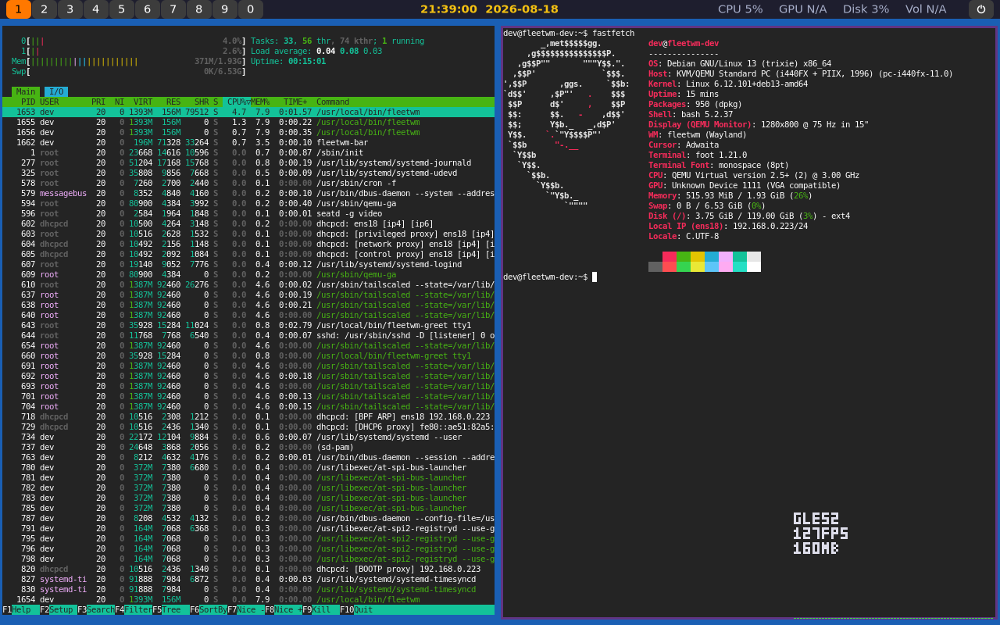

# Features

The original feature list. The README has the short version.

- Tiling window manager (master-stack layout + floating toggle), per-output
  workspaces 1-9/0 with persistent per-workspace layout state
- Top bar: workspace switcher, live clock (`yyyy-mm-dd hh:mm:ss`), volume,
  CPU/GPU/disk usage
- Settings app: rounded/sharp corner toggle, 5 themes (Dark, Catppuccin,
  Dracula, OLED Black, Light), custom or wallpaper-auto-extracted accent
  color
- Settings app -- Bar tab: workspace-button corner shape, per-workspace
  colors; Wallpaper tab: image or solid-color background
  (`fleetwm-wallpaper`), applied live
- Battery indicator and power-profile switching (Normal/Performance/
  Battery Saver) in the bar and Settings, shown only on machines with a
  battery
- Settings app -- Default Apps: per-category default application picker
  (browser, terminal, file manager, image viewer, etc.), backed by
  standard `xdg-mime`/`mimeapps.list` associations so OS-level and other
  XDG-aware apps see the same defaults fleetwm sets
- Settings app -- About: hardware summary (CPU, GPU, RAM, disk, kernel)
  and project info (fleetwm version, license, links), in the spirit of
  KDE's/XFCE's/Windows' "About This System" pages
- Power menu (`fleetwm-powermenu`, click the power icon at the right
  edge of the bar): Lock, Log out, Sleep, Reboot, Shut down, as a
  centered card over a full-screen overlay
- Lock screen (`fleetwm-locker`, `Alt+Shift+L` or the power menu's
  Lock): PAM-verified password prompt reusing the greeter's visual
  language; gates every global keybind while locked
- Systray (StatusNotifierItem/`org.kde.StatusNotifierWatcher`) in the
  bar, for apps like Steam/Discord that dock a tray icon
- Themed pinned-window borders (accent-colored, configurable
  thickness) for always-on-top windows, set in Settings' Theme tab
- Audio mixer (`fleetwm-audiomixer`, click the volume stat in the bar):
  master volume slider plus a live per-application slider for every
  currently-playing app (PipeWire's stream graph, same data
  `pavucontrol`/`wpctl` show), as a compact popup near the bar. The same
  controls are also available as Settings' Audio tab.
- App launcher (`fleetwm-launcher`, `Alt+D`): minimal Albert/dmenu-style
  popup, fuzzy search over installed applications (via `GDesktopAppInfo`)
  with a category hint per result, plus a "Run Command" fallback for
  typed shell commands
- File manager (`fleetwm-fm`, see `docs/FILE_MANAGER.md`): Windows 7 style by default, other styles in its settings; tabs, search, thumbnails,
  verified copies (checksum read back from the device), safe eject, network places (SMB, SFTP, FTP, WebDAV/Nextcloud, NFS) and a freedesktop trash,
  drawn in code (no GTK, no image files)
- Desktop (`fleetwm-desktop`, docs/DESKTOP.md): in the Desktop layout the icons of `~/Desktop` and a Windows 7 style right-click menu (View, Sort by, New,
  Personalize, show/hide icons); in the Tiling layout a small card showing the keys for the shortcut list
- XWayland support for legacy X11 apps
- Debug overlay (`Alt+Shift+I`): a per-output frame-time bar graph plus
  live renderer backend/FPS/RAM/CPU-MHz text, for actually seeing render
  performance (and whether it's GPU-accelerated or software) rather than
  guessing at it -- drawn with a hand-coded bitmap font (no font
  library) and reads no storage at all (RSS via a pure `getrusage()`
  syscall; CPU MHz via sysfs, which is generated in-kernel and never
  touches a disk either)
- `fleetwm-update`: pulls and rebuilds the latest version in place

